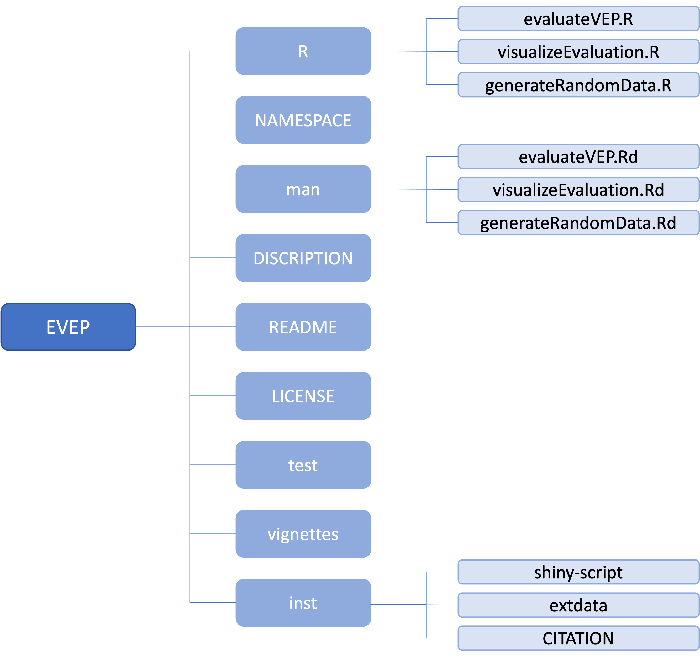

<!-- README.md is generated from README.Rmd. Please edit that file -->

# EVEP

A Package to Evaluate Variant Effect Prediction.

## Description

The objective of `EVEP` is to evaluate the effectiveness of training
data size or data augmentation for machine learning variant effect
prediction. Users should have their own dataset and use this tool to analyse, 
but sample dataset can be generated. This package contains the main components:
DESCRIPTION, NAMESPACE, man subdirectory and R subdirectory. Additionally, 
licence, README and subdirectories vignettes, tests, data and inst are also 
added. `EVEP` is developed using R version 4.2.1 and Mac.

## Installation

To install the latest version of the package:

``` r
require("devtools")
devtools::install_github("SZFukunaga/EVEP", build_vignettes = TRUE)
library("EVEP")
```

To run the shinyApp
``` r
runEVEP()
```

## Overview

``` r
ls("package:EVEP")
data(package = "EVEP") # optional
```

`EVEP` contains 2 functions to evaluate and visualize the effect of
variant effect prediction. The *evaluateVEP* function calculates
statistical measures such as pearson correlation, kendall correlation or
mean squared error. User-defined statistical measures can be added. The
*visualizeEvaluation* generates a plot which represents the statistical
measure from *evaluateVEP*. This function helps users to understand how
training data size and data augmentation affects the accuracy of VEP
along the statistical measure of choice.
In addition, this package has 1 function, *generateRandomData*, to generate
random sample dataset. It is expected that users prepare thier own dataset, but
this function may be useful to test this package for example.
Vignettes can be used for more detail.

``` r
browseVignettes("EVEP")
```

An overview of the package is illustrated below.



## Contributions

The author of the package is Shuzo Fukunaga. The *evaluateVEP* and
*visualizeEvaluation* make use of onlu build-in R functions.

## References

Horne, J., Shukla, D. (2022) Recent Advances in Machine Learning Variant
Effect Prediction Tools for Protein Engineering. *Indivisual &
Engineering Chemistry Research* 61, 6235-6245.
<https://pubs.acs.org/doi/10.1021/acs.iecr.1c04943>

R Core Team (2021). R: A language and environment for statistical
computing. R Foundation for Statistical Computing, Vienna, Austria.
<https://www.R-project.org/>

Bonnet, D.G., Wright, T.A., (2000) Sample size requirements for estimating pearson, kendall and spearman correlations. *Psychometrika* 65, 23–28.
<https://doi.org/10.1007/BF02294183>


## Acknowledgements

This package was developed for 2022 BCB410H Assignment: Applied
Bioinformatics course at the University of Toronto, Toronto, CANADA.
