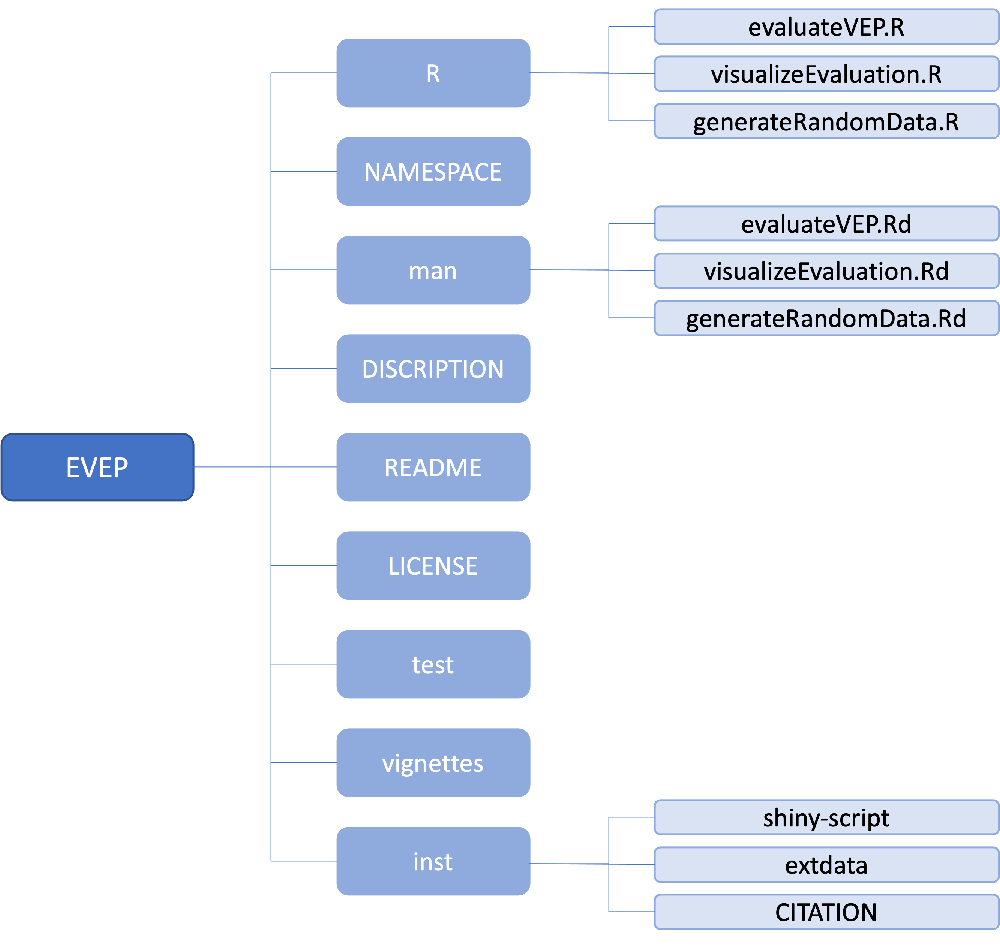
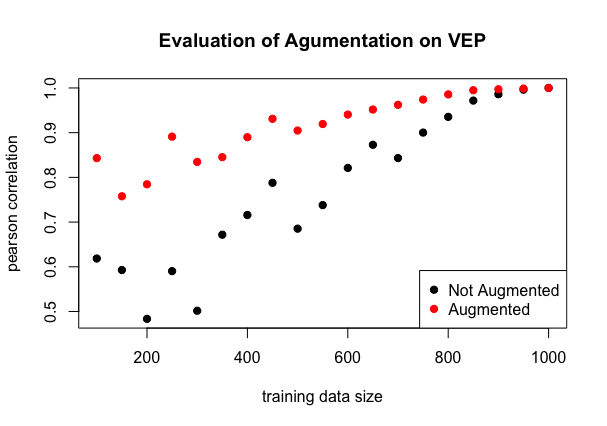

```{r setup, include=FALSE}
library(knitr)
opts_chunk$set(fig.align = "center", 
               out.width = "90%",
               fig.width = 6, fig.height = 5.5,
               dev.args=list(pointsize=10),
               par = TRUE, # needed for setting hook 
               collapse = TRUE, # collapse input & ouput code in chunks
               warning = FALSE)
knit_hooks$set(par = function(before, options, envir)
  { if(before && options$fig.show != "none") 
       par(family = "sans", mar=c(4.1,4.1,1.1,1.1), mgp=c(3,1,0), tcl=-0.5)
})
set.seed(1) # for reproducibility
```

## Introduction

The objective of `EVEP` is to evaluate the effectiveness of training
data size or data augmentation for machine learning variant effect
prediction. Users should have their own dataset and use this tool to analyse, 
but sample dataset can be generated. This package contains the main components:
DESCRIPTION, NAMESPACE, man subdirectory and R subdirectory. Additionally, 
licence, README and subdirectories vignettes, tests, data and inst are also 
added. `EVEP` is developed using R version 4.2.1 and Mac.

Variant effect prediction (VEP) is to predict the functional
change corresponding to an amino acid sequence and potential mutation
for a given protein. VEP often adopts machine learning (ML) models
trained by actual experimental data measuring quantitative effect of
mutations1. However, there is a paradox for the training data size.
Generally, the more training data is prepared, the more accurate
predictions are made, while the more time, money and labour are required
at the same time. Therefore, it is important to estimate the size of
experimentally obtained training data from which ML VEP’s prediction is
sufficiently accurate. It also helps that a machine learning model which
is able to estimate the variant effect from small size of training data
can make VEP more efficient in terms of training data preparation. For
the latter purpose, data augmentation is sometimes used for ML models
for VEP. Data augmentation is a technique to increase the data size by
making a small change in the original data. There are many possible data
augmentation methods as data augmentation is frequently used in other
fields such as image recognition and natural language processing.
However, as data augmentation has been rarely done in protein
engineering, there is no consensus about effectiveness of various
methods for data augmentation in VEP. `EVEP` analyzes and visualizes the
relationship between training data size and prediction accuracy. It also
can be used to evaluate the contribution of data augmentation. Users can
make a use of this tool to estimate a required size of training data for
a given accuracy or cost performance.

To download **EVEP**, use the following commands:

``` r
require("devtools")
install_github("SZFukunaga/EVEP", build_vignettes = TRUE)
library("EVEP")
```
To list all sample functions available in the package:
``` r
ls("package:EVEP")
```

To list all sample datasets available in the package:
``` r
data(package = "EVEP")
```

<br>

## Components

<div style="text-align:center">

## Functions
The **generateRandomData** A function to generate a random sample dataset. Generated dataframe consisits of four columns, sizes of data, predicted values for non-augmented and augmented data, actural value.
Example:
``` r
df_random_data <- generateRandomData()
head(df_random_data)
#   data_size non_augmented_value augmented_value actual_value
# 1       350            2.952409        2.796620     2.792081
# 2       350            2.693442        2.482687     2.486044
# 3       150            8.570522        5.845600     4.732654
# 4       100            3.899022        6.029843     4.532826
# 5       150            2.373602        2.267284     2.506722
# 6       450            5.568432        4.575852     4.973097
```

The **eveluateVEP** A function to calculate a given statistical measure with a training data for variant effect prediction (VEP).
Example:
``` r
df_random_data <- generateRandomData()
pearsonVEP <- evaluateVEP(df_random_data)
head(pearsonVEP)
#   data_size pearson_corr_non_aug pearson_corr_aug
# 2       350            0.6717080        0.8452305
# 3       150            0.5927455        0.7577086
# 4       100            0.6184813        0.8430420
# 5       450            0.7877942        0.9309379
# 6       700            0.8431637        0.9622061
# 7       250            0.5902983        0.8911285
```
The **visualizeEvaluation** A function to visualize the relationships between accuracy of VEP and training data size, or and data augmentation.
Example:
```r
df_random_data <- generateRandomData()
visualizeEvaluation(df_random_data)
```
<div style="text-align:center">

<br>

## Package References

Fukunaga, S. (2022) EVEP: Evaluation of Variant Effect Prediction. Unpublished.
  URL https://github.com/SZFukunaga/EVEP

<br>

## Other References

Horne, J., Shukla, D. (2022) Recent Advances in Machine Learning Variant Effect Prediction Tools for Protein Engineering. Indivisual & Engineering Chemistry Research 61, 6235-6245. https://pubs.acs.org/doi/10.1021/acs.iecr.1c04943

R Core Team (2021). R: A language and environment for statistical computing. R Foundation for Statistical Computing, Vienna, Austria. https://www.R-project.org/

Bonnet, D.G., Wright, T.A., (2000) Sample size requirements for estimating pearson, kendall and spearman correlations. Psychometrika 65, 23–28. https://doi.org/10.1007/BF02294183

```{r}
sessionInfo()
```
